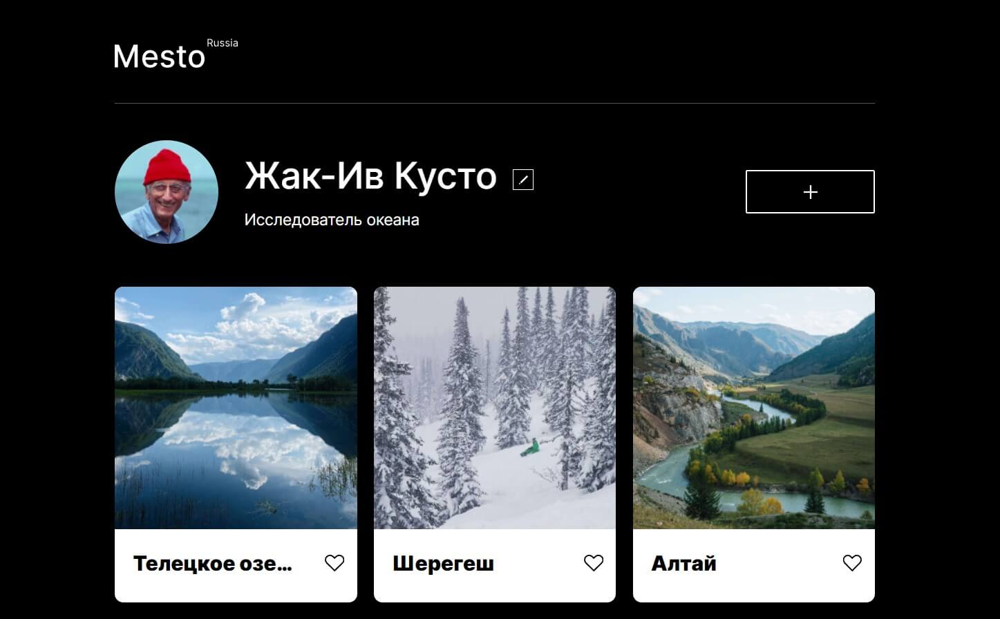

# Проект: МЕСТО &bullet;   

Cервис [Место](https://olgalatkina.github.io/mesto/): можно добавлять фотографии, удалять их и ставить лайки

- Файловая структура по БЭМ (Nested)
- Обнуление стилей при помощи normalize.css
- Подключены шрифты через @font-face
- Использованы css-переменные
- Использованы Flex и Grid для построения сеток и выравнивания
- Использованы @media для адаптации под разные разрешения экрана
- Вёрстка из Фигмы
- Функционал на "ванильном" JavaScript

**Figma**

* [Ссылка на макет в Figma](https://www.figma.com/file/2cn9N9jSkmxD84oJik7xL7/JavaScript.-Sprint-4?node-id=0%3A1)
